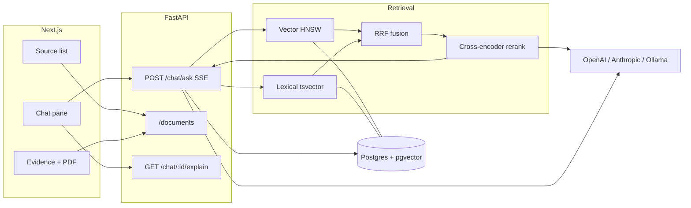

# RAG Research Assistant

Grounded question answering over a small NLP-paper corpus. Ask a question, get an answer with page-level citations, open the cited PDF, and inspect *why* those passages were retrieved.

The stack is FastAPI + PostgreSQL/pgvector + a Next.js UI. Embeddings and reranking run locally (no API key). Generation uses OpenAI, Anthropic, or Ollama when configured, and the app still runs in retrieval-only mode without a key.

---

## Quick start

You need **Python 3.12+**, **Node 20+**, and **Docker**.

```bash
git clone <this-repo>
cd demo   # or whatever the directory is called

cp .env.example .env
# Optional: set LLM_PROVIDER=openai and OPENAI_API_KEY=... for generated answers.
# Leave LLM_PROVIDER=none to browse retrieval + evidence with no key.

docker compose up -d          # Postgres 17 + pgvector on :5435, Redis on :6380

python3.12 -m venv .venv
source .venv/bin/activate     # Windows: .venv\Scripts\activate
pip install -e "./api[dev]"
pip install -e "./api[openai]"   # skip if you have no OpenAI key

# Seed corpus: 12 arXiv PDFs + 100 UDA-QA gold questions.
# PDFs are not in git (license + size). This downloads ~10MB from arXiv.
PYTHONPATH=api python api/scripts/fetch_corpus.py
PYTHONPATH=api python api/scripts/ingest_corpus.py
# First ingest downloads local ONNX models (~100MB) and embeds every chunk. A few minutes.

# API — from the api/ directory so pydantic-settings finds ../.env
cd api && uvicorn app.main:app --reload --port 8000
```

In a second terminal:

```bash
cd web
npm install
npm run dev                   # http://localhost:3000
```

Open [http://localhost:3000](http://localhost:3000). The header should show a document count and either a model name or **retrieval only**.

**Without a key:** sources, ranked evidence, and upload still work. Asking a question returns retrieved passages instead of a generated answer.

**With Ollama instead of a hosted key:**

```bash
brew install ollama && ollama serve
ollama pull qwen3:8b
# in .env: LLM_PROVIDER=ollama
```

---

## What you can do in the UI

- Ask a question; the answer streams token-by-token with inline citation chips.
- Click a chip to open the source PDF on that page, with the quoted passage beside it.
- Upload additional PDFs; they are ingested in the background and join the index.
- Open **Why this answer?** for a plain-language retrieval summary (and, by default, the per-candidate score table).

Starter prompts are on the empty conversation. Try a lookup (“What activation function do they use?”) and a question the corpus cannot answer, to see abstention.

---

## Architecture



Ingestion is extract (PyMuPDF blocks) → paragraph-aware chunks (~320 tokens) → local `bge-small-en-v1.5` embeddings → Postgres. Contextual retrieval (Anthropic-style index-time blurbs) is implemented and **off** by default (`CONTEXTUALIZE=false`) so the index does not depend on a key.

Query path: embed the question locally → hybrid SQL (vector + `websearch_to_tsquery`, fused with RRF, k=60) → cross-encoder rerank of the top 20 → 6 chunks to the generator → streamed answer with citations. Cited chunks from the previous turn are carried forward only when the new question looks like a follow-up.

Why this retrieval, not a framework or a graph: the brief is a 12-document lookup corpus. Hybrid + rerank is the standard production pattern; every rank is stored and shown. LangChain would hide those scores. Graph-based retrieval is a natural next step when questions become thematic or the corpus grows — see [Beyond a local app](#beyond-a-local-app).

---

## Evaluation

Gold set: **100 expert questions** from UDA-QA PaperText over the 12 seed papers (57 extractive, 29 free-form, 14 yes/no). Labels are external, not self-authored.

Two families of metric, kept separate:

**Required RAG metrics** — no reference answer needed: did we find the right source, stay inside it, and cite it?

**Correctness** — only because UDA-QA shipped expert answers. Without that gold set we would not report it. It is *not* averaged into the required scores.

### Retrieval (reproducible, no API key)

Document-level Recall@k on all 100 questions. The index also contains one uploaded distractor paper.

| Config | R@6 | MRR | nDCG@6 | vs vector-only |
| --- | --- | --- | --- | --- |
| A — vector only | 66% | 0.55 | 0.59 | — |
| B — hybrid (RRF) | 71% | 0.61 | 0.65 | +5, p = 0.23 |
| **C — hybrid + rerank, depth 20** | **82%** | **0.68** | **0.71** | **+16, p = 0.0001** |
| C — depth 50 | 78% | 0.67 | 0.71 | +12 |

Reranking is the win, not hybrid fusion. Depth is non-monotonic: 20 beats 30 and 50 — more candidates give the cross-encoder more chances to promote a plausible wrong chunk. Hybrid is effectively free (32ms vs 26ms). Full table, Wilson intervals, and McNemar tests: [`eval/results/retrieval_ablation.md`](eval/results/retrieval_ablation.md).

```bash
cd api && PYTHONPATH=. python scripts/run_eval.py --retrieval
```

### Generation

Answered once under the chosen config (`gpt-4.1-mini`, judged by `gpt-5-mini` where a judge is used).

| Required | Value |
| --- | --- |
| Faithfulness (non-abstentions) | **0.91** (89/98 scored) |
| Answer rate | 98% |
| Answers with no citation | 0 |

| Extra (gold given) | n | Mean |
| --- | --- | --- |
| Extractive token recall | 57 | 0.48 |
| Yes/no accuracy | 14 | 0.58 |
| Free-form judge {0, 0.5, 1} | 29 | 0.52 |

~50% span overlap is expected for prose against extractive gold (`english`, `CNN`). Exact match is 0/57. Conditional on the gold document reaching the prompt, extractive recall rises to 0.55. The 18 retrieval misses are fluent, well-cited answers to the *wrong paper* — faithfulness 1.0, correctness 0. That is the metric split working.

Failure buckets: 18 retrieval misses, 2 over-abstentions (right doc in context, still refused), 2 unsupported generations, 28 partially grounded, 0 missing citations. Details: [`eval/results/generation.md`](eval/results/generation.md).

```bash
cd api && PYTHONPATH=. python scripts/run_eval.py --generation   # needs a judge key
```

Ragas and Evidently were evaluated and not used as the harness. Ragas 0.4.3 needs the LangChain stack, failed to import on a clean install, and its correctness metric scored 0.0 on all ten real samples because it assumes full-sentence references. Evidently’s strength is production monitoring over time — named below as the path after a local app. Retrieval metrics are exact arithmetic on ranks we already persist; faithfulness follows Ragas’s algorithm (decompose → entail → fraction supported) with versioned prompts we own.

---

## Explainability

Every answer has page-level citations, the quoted passage, and an abstention path. That surface is always on.

**Why this answer?** has two tiers:

1. **Plain-language summary** (always shown), derived from the stored trace with no model call — how many passages were used, which search arm found them, whether the reranker changed the top hit.
2. **Per-candidate diagnostics table**, gated by `NEXT_PUBLIC_SHOW_DIAGNOSTICS` (default on). Vector / lexical / RRF / rerank scores and whether the chunk reached the prompt.

The table is an operator view. Raw scores are unnormalized (`rrf_score = 0.0312` means nothing without k=60; `rerank_score = 7.72` is an unbounded logit). In a real deployment this belongs behind a role; the env flag is the local equivalent. It stays default-on so a reviewer sees why rerank is worth its cost: on a typical query the passage both arms ranked first is demoted, and a lower vector hit is promoted to first.

Traces are rows in `retrieval_traces`, keyed by `message_id`, served from `GET /chat/{message_id}/explain`. The same table is what the eval harness scores.

---

## Project layout

```
api/app/          FastAPI app, RAG pipeline, eval harness
api/scripts/      fetch_corpus, ingest_corpus, run_eval
api/tests/        citation parsing, title extraction, eval metrics
web/              Next.js UI
eval/gold/        100 UDA-QA questions
eval/results/     generated ablation + generation reports
corpus/           PDFs after fetch (gitignored)
```

---

## API

| Method | Path | |
| --- | --- | --- |
| GET | `/health` | documents, chunks, generation on/off |
| GET/POST/DELETE | `/documents`, `/upload`, `/{id}/file` | corpus + inline PDF |
| POST | `/chat/ask` | SSE: `meta`, `token`, `citation`, `done` |
| GET | `/chat/{message_id}/explain` | retrieval trace |
| GET | `/conversations`, `/conversations/{id}` | history |

Docs: [http://localhost:8000/docs](http://localhost:8000/docs).

---

## Tests

```bash
cd api && PYTHONPATH=. pytest -q
cd web && npm test
```

No database or API key required. Coverage is the functions that are easy to get wrong: citation groups (`[1,2]`, `[1-3]`), abstention, title extraction against synthetic PDFs, answer block parsing, trace summaries, Recall@k / nDCG / Wilson / McNemar.

---

## What we built

- Hybrid retrieval (pgvector + Postgres FTS + RRF) and a local cross-encoder, with the depth chosen by ablation rather than defaulted.
- Grounded generation: inline citations, stream over SSE, explicit abstention, limited follow-up carry-forward.
- Upload path with font-size title extraction that ignores arXiv stamps and license banners.
- Three-pane UI, WCAG AA contrast, keyboard-activatable citations, skip link, `prefers-reduced-motion`.
- Persisted retrieval traces and a two-audience explanation dialog.
- A reproducible eval harness: required RAG metrics + correctness because gold existed.

## What we would add next

- **GPU or hosted rerank** — the CPU cross-encoder is ~1.7s/query and dominates latency.
- **Fix the remaining 18% retrieval misses** — query rewriting / HyDE for underspecified questions (“What was the baseline?”) that match the wrong paper.
- **Tighten over-abstention** — two questions had the right document in context and still refused.
- **Graph-based retrieval** once the corpus is ~1,000 documents *or* eval shows a cluster of thematic / aggregation failures. Keep hybrid for lookups; route global questions down a graph path.
- **Auth and tenancy** before any shared deployment.
- **A real ingest queue** — today’s worker is in-process.

## Beyond a local app

The brief asks what changes past a laptop. In order of leverage:

1. **Rerank off the request path** — GPU box or Cohere-class API (~10ms). Same model, different hardware.
2. **Continuous eval** — the same faithfulness and retrieval checks, tracked over time with drift alerts. [Evidently](https://www.evidentlyai.com/llm-guide/rag-evaluation) is the named tool for that job; we did not use it for the one-shot ablation because it cannot re-run our retriever under swept configs.
3. **Separate ingest from query** — object store for PDFs, a worker pool, HNSW rebuilds off the write path.
4. **Redis** is already in Compose and only health-checked. First use: cache query embeddings and exact-match answers.
5. **Multi-tenant Postgres** (row-level `tenant_id` on documents and chunks) once there is more than one user. Auth is a prerequisite, not a UI extra.

At 12 papers, stuffing the corpus into a long-context prompt is a legitimate baseline (~200k tokens). We still retrieve because the brief requires a RAG pipeline and because that is what still works at 1,000 papers. The trade-off is named, not hidden.

---

## Limitations

- Text PDFs only; no OCR.
- Single user; no auth.
- Document-level retrieval gold, not chunk-level (chunk labels cannot be derived without circularity).
- One judge, one vendor. Convention prefers two heterogeneous judges.
- Redis unused beyond `/health`.
- Seed PDFs are fetched from arXiv at setup and are not redistributed in this repo.

---

## License note

`fetch_corpus.py` pulls arXiv PDFs for local evaluation. They are not committed. Check each paper’s license before any redistribution.
